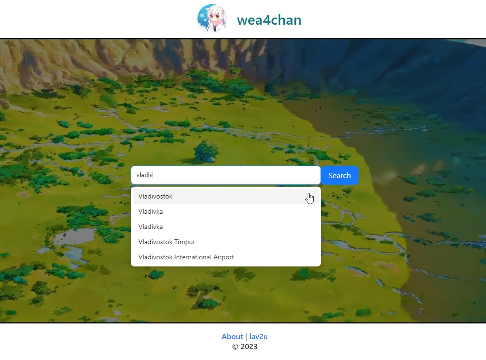
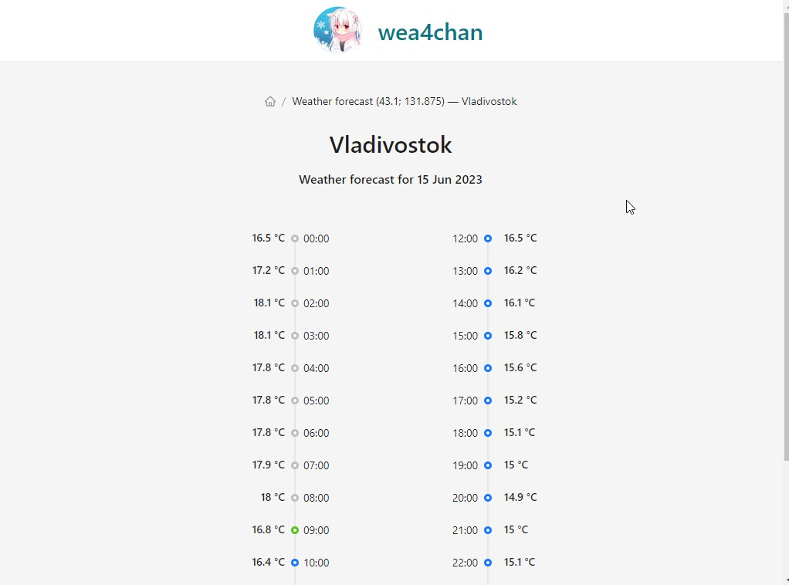

# wea4chan

Weather forecast for nyans... Yes, we nyan! That's a joke. This is my training project where I tested `react-testing-library`. This app uses the external API of `open-meteo.com`.

### Live Demo

- You can check it out by following <b><a href="https://serpo-dev.github.io/wea4chan" target="_blank">this link</a></b> 🔗 :

`https://serpo-dev.github.io/wea4chan/`

## Demo Desktop Screenshots 🖥️

    
    

## Usage 

Just run the `npm install` if you already have `node v18+` and `npm` installed.

- `npm run test` for test the application (*this is the main reason why the app was created*)
- `npm run start` for development mode
- `npm run build` for production mode

